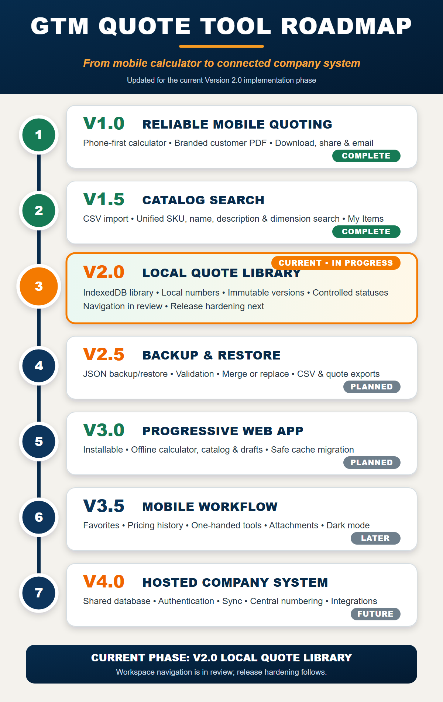

# GTM Calc and Quote Tool

A simple USD quote calculator for packaging sales. It calculates landed cost, GTM dollars, and GTM percent, then builds a quote that can be copied or opened in the default email app.


## Live App

GitHub Pages URL: https://sactowilly.github.io/gtm-calc/

## Version 1 Release Candidate

Version 1 is ready for final owner testing when the release-candidate branch is merged, GitHub Pages deploys, and the live app passes a short real-device smoke test:

- Android: create, save, reload, edit, preview, download, and share a real quote PDF.
- Laptop: download the PDF, use Email Rep, and use Email Customer.
- Privacy: customer PDF, customer email, and customer copy output never include cost, freight cost, GTM dollars, GTM percent, vendor details, internal notes, or other profitability fields.
- Data safety: New Quote warns before clearing unsaved work, saved legacy quotes still reopen, and corrupt local saves are moved to a recovery key instead of crashing the app.
- Accessibility: phone controls remain usable at narrow widths, visible buttons meet touch-target expectations, and the app has no serious or critical automated accessibility findings.

After those checks pass, tag the accepted `main` commit as `v1.0.0`.

## What It Calculates

- Landed unit cost = unit cost + freight per unit
- GTM$ = `(price - landed unit cost) * qty`
- GTM% = `(price - landed unit cost) / landed unit cost * 100`

The existing GTM% calculation is mathematically a **markup percentage** because landed cost is the denominator. This foundation release preserves both the formula and its current UI label; it does not substitute gross margin.

All costs, prices, freight, totals, and GTM dollar values are USD.

## Features

- Add item name, qty, UOM (`EA`, `CS`, `BND`, `PLT`, or `CL`), unit cost, price, optional freight, and optional customer-facing lead time.
- Store UOM with each line item; legacy saved items default to `EA`.
- Enter/display per-unit cost and price to five decimal places without unnecessary trailing zeroes.
- Treat freight as either per-item freight or total freight amortized across qty.
- Add, edit, and delete quote line items.
- Save customer name/address, buyer contact details, Sales Rep, quote date, ship method, F.O.B. point, terms, customer-facing notes, totals, and line-item details.
- Save the active quote locally in the browser.
- Copy the internal quote text, or open a prepared email for the rep or customer. Customer email excludes cost and GTM fields and uses Buyer Email as the recipient.
- Download the PDF and attach it manually: browser `mailto:` links cannot attach local files automatically.
- Preview and explicitly download a branded customer quotation with wrapped fields, repeating multi-page item headers, notes, and a stable footer. The PDF omits internal cost and GTM values.
- Share the generated PDF through the native mobile Share Sheet when file sharing is supported; otherwise download it and open a prepared email with the exact attachment filename.
- Show the current app version/build marker on load.

## Roadmap



- **Version 1.0 - Reliable Mobile Quoting:** phone-first calculator, branded customer PDF, download/share/email, and local active quote storage.
- **Version 1.5 - Catalog Search (in progress):** the tested CSV normalization/import/search foundation is merged; local catalog storage, phone-friendly import/search, manual items, and recent items are the next delivery slice.
- **Version 2.0 - Local Quote Library:** IndexedDB-backed quotes and customers, quote statuses, quote numbers, duplication, and revisions.
- **Version 2.5 - Backup and Restore:** JSON backup/restore, validation, merge or replace, CSV exports, quote JSON export, and PDF export.
- **Version 3.0 - Progressive Web App:** installable app shell, offline catalog/calculator/drafts, update notifications, and cache migration.
- **Version 3.5 - Mobile Workflow Improvements:** favorites, recent customers, frequent item combinations, pricing history, attachments, one-handed controls, and dark mode.
- **Version 4.0 - Hosted Company System:** future centralized access with shared storage, authentication, synchronization, central quote numbering, integrations, reporting, and permissions.

## Develop and Test

Node.js 20.19 or newer is required. Install the committed dependency versions and start the Vite development server:

```bash
npm ci
npm run dev
```

The development URL uses the repository base path: `http://localhost:5173/gtm-calc/`.

Run the same checks used by pull requests:

```bash
npm run check
npm test
npm run test:visual
npm run test:compat
npm run build
```

`npm run build` writes the production artifact to `dist/` with the `/gtm-calc/` base path. GitHub Pages still uses the legacy `main` branch root in this pull request; deployment is not switched to the Vite artifact yet.

## Files

- `index.html` - app markup
- `css/main.css` - responsive styling
- `js/main.js` - DOM adapter, quote state, local save, preview/download, copy, and email behavior
- `js/domain/` - pure legacy calculations, normalization, totals, and formatting
- `js/pdf/` and `css/quote-pdf.css` - customer-safe document projection, HTML template, pagination, and browser PDF rendering
- `tests/` - calculation, privacy, fixture, and browser layout regression tests
- `assets/vision-industrial-packaging-logo.png` - complete logo artwork extracted from the approved quotation reference
- `vite.config.js` - production build configuration for the GitHub Pages base path
- `assets/gtm-calc-icon.png` - 1280x640 project image
