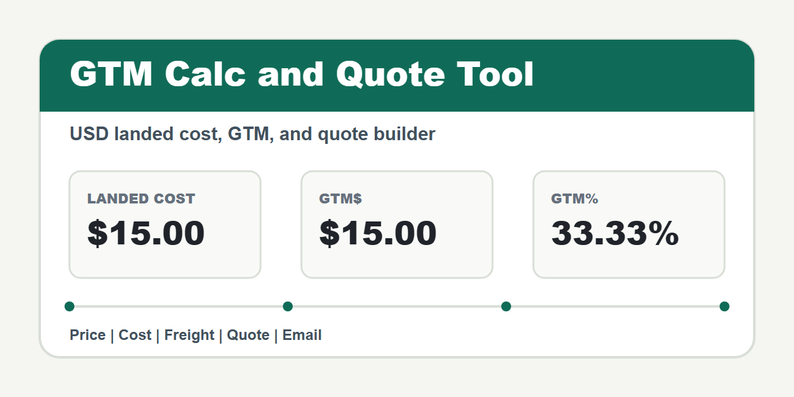

# GTM Calc and Quote Tool

A simple USD quote calculator for packaging sales. It calculates landed cost, GTM dollars, and GTM percent, then builds a quote that can be copied or opened in the default email app.



## Live App

GitHub Pages URL: https://sactowilly.github.io/gtm-calc/

## What It Calculates

- Landed unit cost = unit cost + freight per unit
- GTM$ = `(price - landed unit cost) * qty`
- GTM% = `(price - landed unit cost) / landed unit cost * 100`

The existing GTM% calculation is mathematically a **markup percentage** because landed cost is the denominator. This foundation release preserves both the formula and its current UI label; it does not substitute gross margin.

All costs, prices, freight, totals, and GTM dollar values are USD.

## Features

- Add item name, qty, UOM (`EA`, `CS`, `BND`, `PLT`, or `CL`), unit cost, price, and optional freight.
- Store UOM with each line item; legacy saved items default to `EA`.
- Enter/display per-unit cost and price to five decimal places without unnecessary trailing zeroes.
- Treat freight as either per-item freight or total freight amortized across qty.
- Add, edit, and delete quote line items.
- Save customer name, address, buyer name/email, Sales Rep, quote date, order total, total cost, total GTM$, and line-item details.
- Save the active quote locally in the browser.
- Copy the internal quote text, or open a prepared email for the rep or customer. Customer email excludes cost and GTM fields and uses Buyer Email as the recipient.
- Download the PDF and attach it manually: browser `mailto:` links cannot attach local files automatically.
- Preview and explicitly download a customer-facing PDF quotation. The PDF omits internal cost and GTM values.
- Show the current app version/build marker on load.

## Develop and Test

Node.js 20.19 or newer is required. Install the committed dependency versions and start the Vite development server:

```bash
npm ci
npm run dev
```

The development URL uses the repository base path: `http://localhost:5173/gtm-calc/`.

Run the same checks used by pull requests:

```bash
npm run check
npm test
npm run build
```

`npm run build` writes the production artifact to `dist/` with the `/gtm-calc/` base path. GitHub Pages still uses the legacy `main` branch root in this pull request; deployment is not switched to the Vite artifact yet.

## Files

- `index.html` - app markup
- `css/main.css` - responsive styling
- `js/main.js` - DOM adapter, quote state, local save, PDF, copy, and email behavior
- `js/domain/` - pure legacy calculations, normalization, totals, and formatting
- `tests/` - calculation and formatting regression tests
- `vite.config.js` - production build configuration for the GitHub Pages base path
- `assets/gtm-calc-icon.png` - 1280x640 project image
