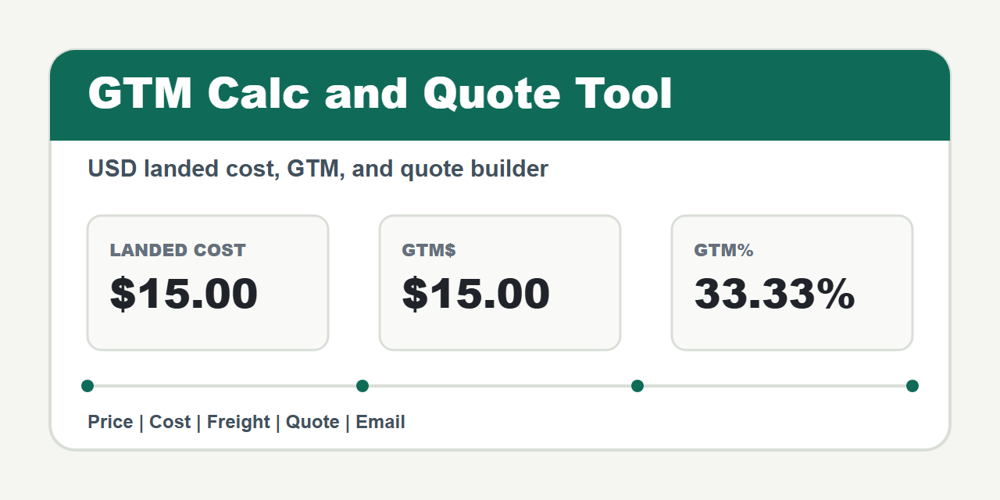
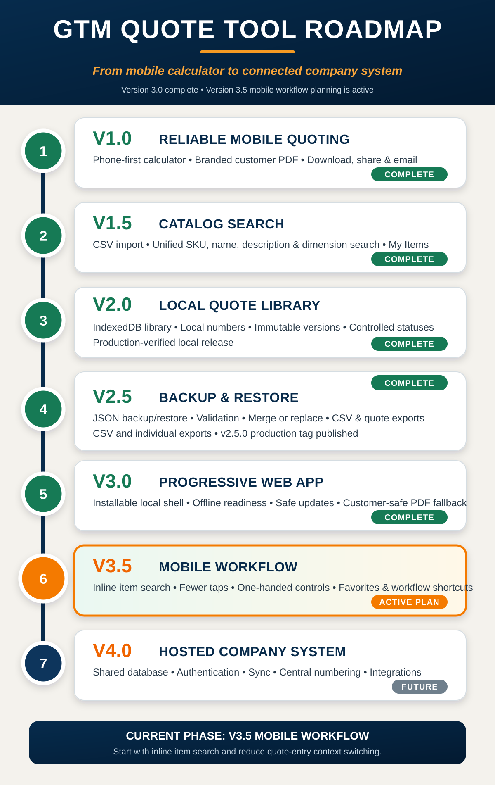

# GTM Calc and Quote Tool

A simple USD quote calculator for packaging sales. It calculates landed cost, GTM dollars, and GTM percent, then builds a quote that can be copied or opened in the default email app.



## Live App

GitHub Pages URL: https://sactowilly.github.io/gtm-calc/

## Current Release Track

Version 1 is the accepted mobile quote foundation. Version 1.5 catalog search is complete. Version 2 is complete: its IndexedDB-backed quote/customer library and lifecycle controls passed automated and owner device acceptance while retaining the original browser save as a fallback. Version 2.5 backup and restore is complete after automated, physical-device, owner, and post-merge Pages acceptance on 2026-08-06. The annotated `v2.5.0` tag is the final release action; Version 3.0 PWA planning can now begin.

The release smoke checks remain:

- Android: create, save, reload, edit, preview, download, and share a real quote PDF.
- Laptop: download the PDF, use Email Rep, and use Email Customer.
- Privacy: customer PDF, customer email, and customer copy output never include cost, freight cost, GTM dollars, GTM percent, vendor details, internal notes, or other profitability fields.
- Data safety: New Quote warns before clearing unsaved work, saved legacy quotes still reopen, and corrupt local saves are moved to a recovery key instead of crashing the app.
- Accessibility: phone controls remain usable at narrow widths, visible buttons meet touch-target expectations, and the app has no serious or critical automated accessibility findings.

The Version 2 acceptance gate passed on 2026-07-27. Annotated tag `v2.0.0` identifies production commit `b61890c`, verified after closeout CI and GitHub Pages deployment succeeded.

## What It Calculates

- Landed unit cost = unit cost + freight per unit
- GTM$ = `(price - landed unit cost) * qty`
- GTM% = `(price - landed unit cost) / landed unit cost * 100`

The existing GTM% calculation is mathematically a **markup percentage** because landed cost is the denominator. This foundation release preserves both the formula and its current UI label; it does not substitute gross margin.

All costs, prices, freight, totals, and GTM dollar values are USD.

## Features

- Add item name, qty, UOM (`EA`, `CS`, `BND`, `PLT`, or `CL`), unit cost, price, optional freight, and optional customer-facing lead time.
- Store UOM with each line item; legacy saved items default to `EA`.
- Enter/display per-unit cost and price to five decimal places without unnecessary trailing zeroes.
- Treat freight as either per-item freight or total freight amortized across qty.
- Add, edit, and delete quote line items.
- Save customer name/address, buyer contact details, Sales Rep, quote date, ship method, F.O.B. point, terms, customer-facing notes, totals, and line-item details.
- Save the active quote locally in the browser.
- Opt into a searchable, device-local draft library without deleting the original `gtm_quote_calculator_v1` browser copy.
- Reopen and duplicate unnumbered drafts, recall saved customers/contacts, and reject stale-tab saves instead of silently overwriting a newer library draft.
- Finalize a saved draft with a local-device number, view immutable current or historical versions, regenerate customer-safe output, create a latest-version revision, and move quotes through the approved Finalized/Sent/outcome status workflow.
- Copy explicitly labeled internal quote text from the workspace, or copy customer-safe text from the PDF dialog. Customer copy/email excludes cost and GTM fields and uses Buyer Email as the recipient.
- Download the PDF and attach it manually: browser `mailto:` links cannot attach local files automatically.
- Preview and explicitly download a branded customer quotation with wrapped fields, repeating multi-page item headers, notes, and a stable footer. The PDF omits internal cost and GTM values.
- Share the generated PDF through the native mobile Share Sheet when file sharing is supported; otherwise download it and open a prepared email with the exact attachment filename.
- Show the current app version/build marker on load.
- Download a complete, validated JSON backup of saved quote, customer, catalog, settings, and recovery data from the local-only Export workspace. The file is unencrypted and contains internal pricing, so the app displays a permanent privacy warning.
- Download quote-list, customer, and manual-item CSV reports from the local-only Export workspace. CSV is a lossy report format and formula-like values are neutralized before download.
- Download an individual saved quote as JSON or a customer-safe PDF from its library card; finalized exports require the selected immutable version and preserve the existing customer-output privacy boundary.

## Roadmap



- **Version 1.0 - Reliable Mobile Quoting:** phone-first calculator, branded customer PDF, download/share/email, and local active quote storage.
- **Version 1.5 - Catalog Search (complete):** CSV import/reporting, normalized unified search, local catalog storage/rollback, manual items, and recent items are merged and owner-tested.
- **Version 2.0 - Local Quote Library (complete):** IndexedDB-backed searchable drafts, customer recall, phone-scale results, highlighted duplicates, local quote numbers, immutable version history, revisions, controlled statuses, and separate Quote/Library/Clients/Catalog workspaces are accepted. Version 2.5 adds the fifth Export destination.
- **Version 2.5 - Backup and Restore (complete):** the complete JSON/checksum foundation, validated local backup download, restore inspection, explicit Merge/Replace transaction, RFC 4180/formula-safe CSV reports, and individual quote JSON/customer-safe PDF downloads passed physical acceptance, owner approval, and post-merge Pages verification. The annotated `v2.5.0` tag is the release boundary.
- **Version 3.0 - Progressive Web App (active planning):** installable app shell, offline catalog/calculator/drafts, update notifications, and cache migration. PWA implementation starts only from the verified V2.5 data/recovery boundary.
- **Version 3.5 - Mobile Workflow Improvements:** favorites, recent customers, frequent item combinations, pricing history, attachments, one-handed controls, and dark mode.
- **Version 4.0 - Hosted Company System:** future centralized access with shared storage, authentication, synchronization, central quote numbering, integrations, reporting, and permissions.

## Develop and Test

Node.js 20.19 or newer is required. Install the committed dependency versions and start the Vite development server:

```bash
npm ci
npm run dev
```

The development URL uses the repository base path: `http://localhost:5173/gtm-calc/`.

Run the same checks used by pull requests:

```bash
npm run check
npm test
npm run test:visual
npm run test:compat
npm run test:source
npm run test:production
```

`npm run test:production` builds and serves `dist/` with the `/gtm-calc/` base path before running a browser smoke. GitHub Pages still uses the legacy `main` branch root; feature branches and pull requests do not deploy production.

## Files

- `index.html` - app markup
- `css/main.css` - responsive styling
- `js/main.js` - DOM adapter, quote state, local save, preview/download, copy, and email behavior
- `js/domain/` - pure legacy calculations, normalization, totals, and formatting
- `js/pdf/` and `css/quote-pdf.css` - customer-safe document projection, HTML template, pagination, and browser PDF rendering
- `tests/` - calculation, privacy, fixture, and browser layout regression tests
- `assets/vision-industrial-packaging-logo.png` - complete logo artwork extracted from the approved quotation reference
- `vite.config.js` - production build configuration for the GitHub Pages base path
- `assets/gtm-calc-icon.png` - 1280x640 project image
